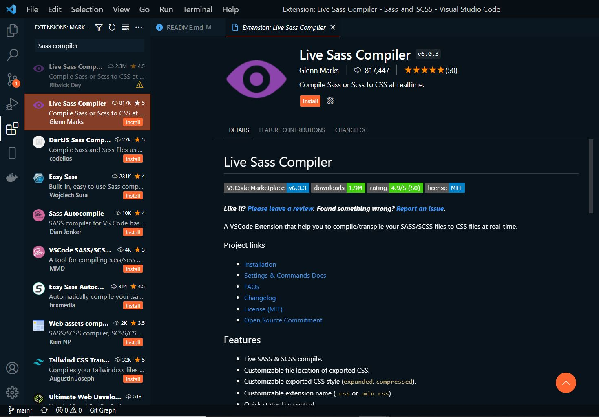
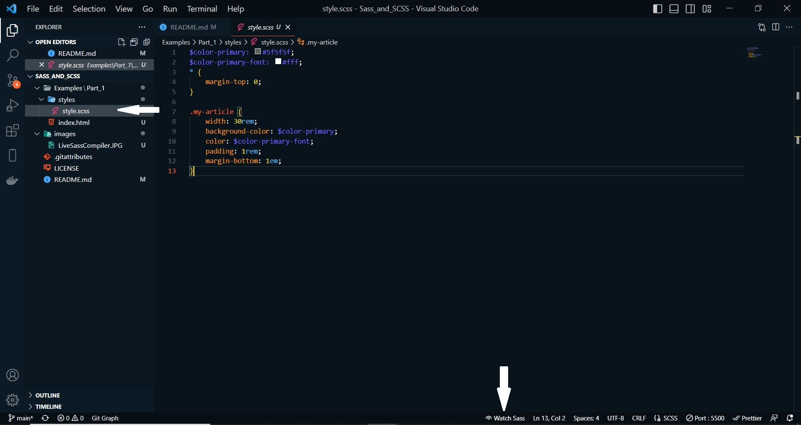
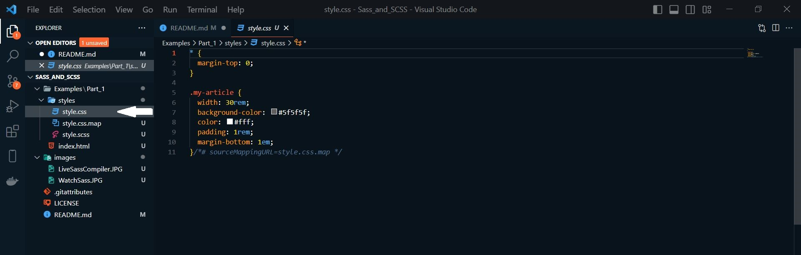
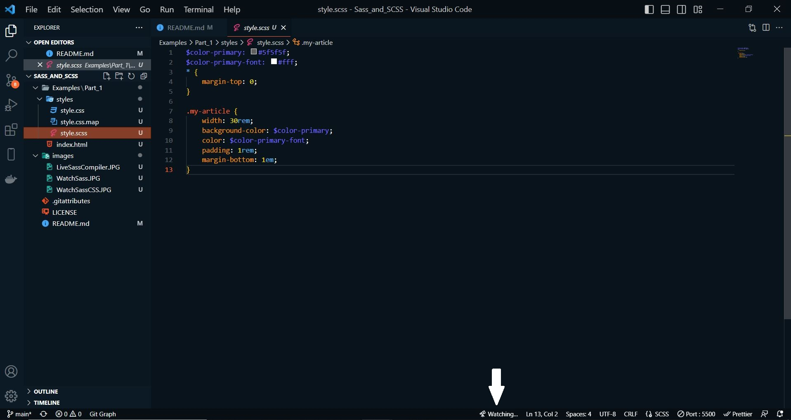

# Sass_and_SCSS

 An introduction to the CSS preprocessor Sass

------------------------------------------------------

## Contents
1. CSS Preprocessor
	- 1.1. The syntax Sass or SCSS
	- 1.2. From Sass/SCSS to CSS
    - 1.3. Install and set up Sass
    - 1.4. Use variables with Sass

------------------------------------------------------

# 1. CSS preprocessor
With a CSS preprocessor the writing of CSS can be made easier, e.g. by eliminating repetitive writing work. And the code handling can be simplified thereby.

**Sass** is just one of many other CSS preprocessors, others would be **Less** and **Stylus**. A preprocessor is used to automate annoying tasks and provide new functionality. A simple example would be when creating a web page with CSS, a green color is assigned countless times to various CSS properties. Once this color green is to be changed to blue, all green elements must now be assigned the color blue. This is where Sass comes into action. Instead of constantly changing repetitive values, the change is made in only one central location according to the DRY principle (Don't repeat yourself).


------------------------------------------------------

## 1.1. The Sass or SCSS syntax
Sass and SCSS are not necessarily two different CSS preprocessors, because both are in the end Sass (Syntactically Awesome Style Sheet). They are just two different grammars. The original syntax was **Sass syntax**, and the syntax introduced afterwards was SCSS (Sassy CSS). The newer SCSS syntax, unlike the Sass syntax, uses curly braces and semicolons. By not using curly braces and semicolons, the Sass syntax is shorter, nesting is done with an indentation.

- Difference between the two syntaxes:

    - SCSS syntax (style.scss)
   ```
    $but-size: 100%;
    $color1: #00ff00;
    $color2: #ff0000;
    $spacing-p: 1em;
    $spacing-m: 0.5em;

    .button-form {
	    width: $but-size;
	    padding: $spacing-p;
	    margin: $spacing-m;
	    background-color: $color1;
	    &:hover {
	    background-color: $color2;
	    color: $color1;
	    }
    }
   ```

    - Sass syntax (style.sass):
   ```
    $but-size: 100%
    $color1: #00ff00
    $color2: #ff0000
    $spacing-p: 1em
    $spacing-m: 0.5em

    .button-form 
	    width: $but-size
	    padding: $spacing-p
	    margin: $spacing-m
	    background-color: $color1
	    &:hover 
	    background-color: $color2
	    color: $color1
   ``` 

-----------------------------------------------------

## 1.2. From Sass/SCSS to CSS
The web browser cannot do anything with the SCSS file, for this the CSS preprocessor must first convert(compile) the SCSS file into a CSS file, which can then also be used for the web browser.

- the result of the SCSS file after the CSS preprocessor run as a CSS file
    - SCSS file (style.scss)
   ```
    $but-size: 100%;
    $color1: #00ff00;
    $color2: #ff0000;
    $spacing-p: 1em;
    $spacing-m: 0.5em;

    .button-form {
	    width: $but-size;
	    padding: $spacing-p;
	    margin: $spacing-m;
	    background-color: $color1;
	    &:hover {
	    background-color: $color2;
	    color: $color1;
	    }
    }
   ```

    - CSS file (style.css)
   ```
    .button-form {
	    width: 100%;
	    padding: 1em;
	    margin: 0.5em;
	    background-color: #00ff00;
    }
	button-form:hover {
	    background-color: #ff0000;
	    color: #00ff00;
	}   
   ```

--------------------------------------------------------

## 1.3. Install and set up Sass

### Set up Sass with Visual Studio Code
To use Sass with Visual Studio Code, simply install the **Live Sass Compiler** extension.

 

With the file index.html the CSS file is already included, but the CSS file does not exist yet.

 example --> *Examples/Part_1/index.html*
   ```
    <head>
        <meta charset="UTF-8">
        <link rel="stylesheet" href="styles/style.css">
        <title>Sass during the execution</title>
    </head>
    <body>
        <article class="my-article">
            <h1>Article 1</h1>
            <p>Lorem ipsum dolor sit amet...</p>
        </article>
        <article class="my-article">
            <h1>Article 2</h1>
            <p>Lorem ipsum dolor sit amet..s.</p>
        </article>
    </body>  
   ``` 

Via Sass the class `my-article` is styled now:

 example --> *Examples/Part_1/styles/style.scss*
   ```
    $color-primary: #5f5f5f;
    $color-primary-font: #fff;
    * {
        margin-top: 0;
    }

    .my-article {
        width: 30rem;
        background-color: $color-primary;
        color: $color-primary-font;
        padding: 1rem;
        margin-bottom: 1em;
    } 
   ```

In order for the CSS preprocessor Sass to now automatically make a CSS file **style.css** out of it, all you have to do is activate the *Watch Sass* option at the bottom of the Visual Studio Code development environment. This turns the live translation from Sass/SCSS to CSS.

 


After *WATCH SASS* is activated, the CSS file is automatically created in the folder where the Sass file is.

 


 example --> *Examples/Part_1/styles/style.css*
   ```
    * {
        margin-top: 0;
    }

    .my-article {
        width: 30rem;
        background-color: #5f5f5f;
        color: #fff;
        padding: 1rem;
        margin-bottom: 1em;
    }    
   ```

As long as *Watch Sass* is enabled, there is no need to worry about updating the CSS file. As soon as changes are made to the SCSS file, the CSS file is automatically adjusted as well. The active live translation can be recognized when the label *Watch Sass* is replaced by the label *Watching*. The translation takes place as soon as the SCSS file is saved again.

 

**When working with Sass and the *Watch Sass* option is enabled, no changes should be made to the CSS file, because now Sass has control over it with the SCSS file. The changes to the CSS document would be overwritten again with an active Sass preprocessor and a recompilation of the SCSS file.**


### Install Sass for the command line
Sass can also be installed via the command line, this requires **Ruby** on the computer. For macOS, **Ruby** is already available. To use **Ruby** for Windows, the [Ruby Installer](https://rubyinstaller.org) must be downloaded and installed. For Linux, the following command must be entered in the command line to install **Ruby**:

   ```
    $ sudo apt-get install ruby
   ```

If Ruby is installed, the command line must be opened. For Windows open the start menu and *START COMMAND PROMPT WITH RUBY*. For macOS and Linux just start the terminal. And then enter the following command:

   ```
    $ gem install sass
   ```

For macOS and Linux, sudo may need to be used:

   ```
    $ sudo gem install sass
   ```

The version number can then be queried with `sass -v`, if the version is displayed, Sass has been successfully installed.

For a compilation of a SCSS file, the following command must be entered in the command line, (in the directory where the Sass file with the extension *.scss is stored) to convert the file into a CSS file:

   ```
    $ sass style.scss:style.css
   ```

In the command line it is also possible to set up monitoring for files or directories, so that after each saved change in the SCSS file are automatically compiled:

   ```
    $ sass -watch style.scss:style.css
   ```

An entire folder can be monitored with the following command:

   ```
    $ sass -watch styles:styles
   ```

It is also possible to create a folder with e.g. **scss** and a folder **css**, for more overview. So that then when compiling this SCSS files the CSS files are stored in the directory **css**:

   ```
    $ sass -watch stylesheets/scss:stylesheets/css
   ```

---------------------------------------------------------

## 1.4. Use variables with Sass
