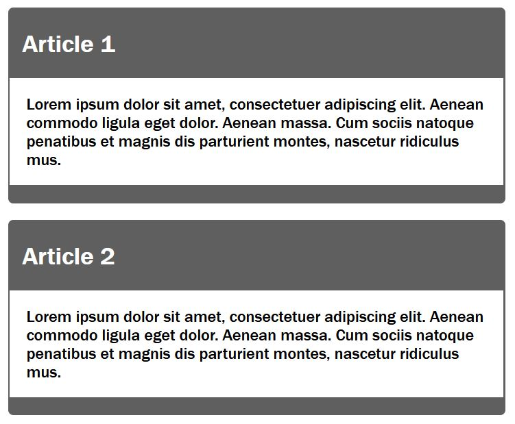
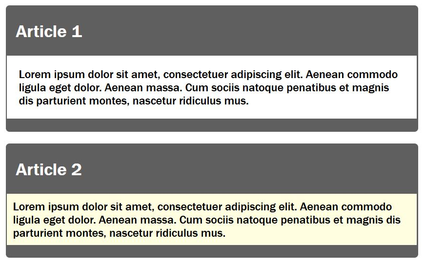

# Sass_and_SCSS

 An introduction to the CSS preprocessor Sass

------------------------------------------------------

## Contents
1. CSS Preprocessor
	- 1.1. The syntax Sass or SCSS
	- 1.2. From Sass/SCSS to CSS
    - 1.3. Install and set up Sass
    - 1.4. Use variables with Sass
    - 1.5. Nesting with Sass
    - 1.6. Mixins (@mixin, @include)
    - 1.7. @extend
    - 1.8. Media queries and @content
    - 1.9. Operators
    - 1.10. Adjust colors and brightness
    - 1.11. Control structures of Sass
    - 1.12. @function
    - 1.13. @import
    - 1.14. Comments

------------------------------------------------------

# 1. CSS preprocessor
With a CSS preprocessor the writing of CSS can be made easier, e.g. by eliminating repetitive writing work. And the code handling can be simplified thereby.

**Sass** is just one of many other CSS preprocessors, others would be **Less** and **Stylus**. A preprocessor is used to automate annoying tasks and provide new functionality. A simple example would be when creating a web page with CSS, a green color is assigned countless times to various CSS properties. Once this color green is to be changed to blue, all green elements must now be assigned the color blue. This is where Sass comes into action. Instead of constantly changing repetitive values, the change is made in only one central location according to the DRY principle (Don't repeat yourself).


------------------------------------------------------

## 1.1. The Sass or SCSS syntax
Sass and SCSS are not necessarily two different CSS preprocessors, because both are in the end Sass (Syntactically Awesome Style Sheet). They are just two different grammars. The original syntax was **Sass syntax**, and the syntax introduced afterwards was SCSS (Sassy CSS). The newer SCSS syntax, unlike the Sass syntax, uses curly braces and semicolons. By not using curly braces and semicolons, the Sass syntax is shorter, nesting is done with an indentation.

- Difference between the two syntaxes:

    - SCSS syntax (style.scss)
   ```
    $but-size: 100%;
    $color1: #00ff00;
    $color2: #ff0000;
    $spacing-p: 1em;
    $spacing-m: 0.5em;

    .button-form {
	    width: $but-size;
	    padding: $spacing-p;
	    margin: $spacing-m;
	    background-color: $color1;
	    &:hover {
	    background-color: $color2;
	    color: $color1;
	    }
    }
   ```

    - Sass syntax (style.sass):
   ```
    $but-size: 100%
    $color1: #00ff00
    $color2: #ff0000
    $spacing-p: 1em
    $spacing-m: 0.5em

    .button-form 
	    width: $but-size
	    padding: $spacing-p
	    margin: $spacing-m
	    background-color: $color1
	    &:hover 
	    background-color: $color2
	    color: $color1
   ``` 


-----------------------------------------------------

## 1.2. From Sass/SCSS to CSS
The web browser cannot do anything with the SCSS file, for this the CSS preprocessor must first convert(compile) the SCSS file into a CSS file, which can then also be used for the web browser.

- the result of the SCSS file after the CSS preprocessor run as a CSS file
    - SCSS file (style.scss)
   ```
    $but-size: 100%;
    $color1: #00ff00;
    $color2: #ff0000;
    $spacing-p: 1em;
    $spacing-m: 0.5em;

    .button-form {
	    width: $but-size;
	    padding: $spacing-p;
	    margin: $spacing-m;
	    background-color: $color1;
	    &:hover {
	    background-color: $color2;
	    color: $color1;
	    }
    }
   ```

    - CSS file (style.css)
   ```
    .button-form {
	    width: 100%;
	    padding: 1em;
	    margin: 0.5em;
	    background-color: #00ff00;
    }
	button-form:hover {
	    background-color: #ff0000;
	    color: #00ff00;
	}   
   ```


--------------------------------------------------------

## 1.3. Install and set up Sass

### Set up Sass with Visual Studio Code
To use Sass with Visual Studio Code, simply install the **Live Sass Compiler** extension.

 

With the file index.html the CSS file is already included, but the CSS file does not exist yet.

   ```
    <head>
        <meta charset="UTF-8">
        <link rel="stylesheet" href="styles/style.css">
        <title>Sass during the execution</title>
    </head>
    <body>
        <article class="my-article">
            <h1>Article 1</h1>
            <p>Lorem ipsum dolor sit amet...</p>
        </article>
        <article class="my-article">
            <h1>Article 2</h1>
            <p>Lorem ipsum dolor sit amet..s.</p>
        </article>
    </body>  
   ```
 [Complete Code](https://github.com/BellaMrx/Sass_and_SCSS/blob/main/Examples/Part_1/index.html) --> *Examples/Part_1/index.html* 

Via Sass the class `my-article` is styled now:

   ```
    $color-primary: #5f5f5f;
    $color-primary-font: #fff;
    * {
        margin-top: 0;
    }

    .my-article {
        width: 30rem;
        background-color: $color-primary;
        color: $color-primary-font;
        padding: 1rem;
        margin-bottom: 1em;
    } 
   ```
 [Complete Code](https://github.com/BellaMrx/Sass_and_SCSS/blob/main/Examples/Part_1/styles/style.scss) --> *Examples/Part_1/styles/style.scss*

In order for the CSS preprocessor Sass to now automatically make a CSS file **style.css** out of it, all you have to do is activate the *Watch Sass* option at the bottom of the Visual Studio Code development environment. This turns the live translation from Sass/SCSS to CSS.

 


After *WATCH SASS* is activated, the CSS file is automatically created in the folder where the Sass file is.

 


   ```
    * {
        margin-top: 0;
    }

    .my-article {
        width: 30rem;
        background-color: #5f5f5f;
        color: #fff;
        padding: 1rem;
        margin-bottom: 1em;
    }    
   ```
 [Complete Code](https://github.com/BellaMrx/Sass_and_SCSS/blob/main/Examples/Part_1/styles/style.css) --> *Examples/Part_1/styles/style.css*

As long as *Watch Sass* is enabled, there is no need to worry about updating the CSS file. As soon as changes are made to the SCSS file, the CSS file is automatically adjusted as well. The active live translation can be recognized when the label *Watch Sass* is replaced by the label *Watching*. The translation takes place as soon as the SCSS file is saved again.

 

**When working with Sass and the *Watch Sass* option is enabled, no changes should be made to the CSS file, because now Sass has control over it with the SCSS file. The changes to the CSS document would be overwritten again with an active Sass preprocessor and a recompilation of the SCSS file.**


### Install Sass for the command line
Sass can also be installed via the command line, this requires **Ruby** on the computer. For macOS, **Ruby** is already available. To use **Ruby** for Windows, the [Ruby Installer](https://rubyinstaller.org) must be downloaded and installed. For Linux, the following command must be entered in the command line to install **Ruby**:

   ```
    $ sudo apt-get install ruby
   ```

If Ruby is installed, the command line must be opened. For Windows open the start menu and *START COMMAND PROMPT WITH RUBY*. For macOS and Linux just start the terminal. And then enter the following command:

   ```
    $ gem install sass
   ```

For macOS and Linux, sudo may need to be used:

   ```
    $ sudo gem install sass
   ```

The version number can then be queried with `sass -v`, if the version is displayed, Sass has been successfully installed.

For a compilation of a SCSS file, the following command must be entered in the command line, (in the directory where the Sass file with the extension *.scss is stored) to convert the file into a CSS file:

   ```
    $ sass style.scss:style.css
   ```

In the command line it is also possible to set up monitoring for files or directories, so that after each saved change in the SCSS file are automatically compiled:

   ```
    $ sass -watch style.scss:style.css
   ```

An entire folder can be monitored with the following command:

   ```
    $ sass -watch styles:styles
   ```

It is also possible to create a folder with e.g. **scss** and a folder **css**, for more overview. So that then when compiling this SCSS files the CSS files are stored in the directory **css**:

   ```
    $ sass -watch stylesheets/scss:stylesheets/css
   ```


---------------------------------------------------------

## 1.4. Use variables with Sass
In order not to have to change constantly repeating properties individually and laboriously in extensive CSS projects, you can save yourself this work with variables in Sass.
Variables are used to set a value for a CSS property that is then used throughout the SCSS document. After compiling the SCSS file, these variables are replaced in the CSS file with the actual value.

A variable is introduced with `$`, followed by the name of the variable without spaces. With the colon a value is assigned to the variable and with the semicolon the line is closed.

   ```
    $variable-name: value;
   ```

in practice:

   ```
    $color-primary: #5f5f5f;
    $color-primary-font: #fff; 
    $font: Arial, sans-serif;
    $spacing-std: 1em; 
   ```

   ```
    $color-primary: #5f5f5f;
    $color-primary-font: #fff;
    $font: 'Franklin Gothic','Arial Narrow',Arial,sans-serif;
    $spacing-std: 1em;
    * {
        margin-top: 0;
    }

    body {
        font-family: $font;
    }

    .my-article {
        width: 30rem;
        background-color: $color-primary;
        color: $color-primary-font;
        padding: $spacing-std;
        margin-bottom: $spacing-std;
    }   
   ```
 [Complete Code](https://github.com/BellaMrx/Sass_and_SCSS/blob/main/Examples/Part_2/styles/style.scss) --> *Examples/Part_2/styles/style.scss*

   ```
    * {
        margin-top: 0;
    }

    body {
        font-family: "Franklin Gothic", "Arial Narrow", Arial, sans-serif;
    }

    .my-article {
        width: 30rem;
        background-color: #5f5f5f;
        color: #fff;
        padding: 1em;
        margin-bottom: 1em;
    }  
   ```
 [Complete Code](https://github.com/BellaMrx/Sass_and_SCSS/blob/main/Examples/Part_2/styles/style.css) --> *Examples/Part_2/styles/style.css*

 


 ---------------------------------------------------

## 1.5. Nesting with Sass
Nesting of selectors (selector nesting) is an enormous relief, however, the use should remain in the frame. A nesting of two to three levels should be sufficient. Here an example within the class `my-article` the selectors `p` and `h1` are nested.

   ```
    ...
    .my-article {
        width: 30rem;
        background-color: $color-primary;
        color: $color-primary-font;
        padding: 0.1em;
        margin-bottom: $spacing-std;
        border-radius: 5px;
        h1 {
            padding-left: 0.5em;
        }
        p {
            background-color: $color-secondary;
            color: $color-secondary-font;
            padding: 1em;
        }
    }  
   ```
 [Complete Code](https://github.com/BellaMrx/Sass_and_SCSS/blob/main/Examples/Part_3/styles/style.scss) --> *Examples/Part_3/styles/style.scss*


   ```
    ...
    .my-article {
        width: 30rem;
        background-color: #5f5f5f;
        color: #fff;
        padding: 0.1em;
        margin-bottom: 1em;
        border-radius: 5px;
    }
    .my-article h1 {
        padding-left: 0.5em;
    }
    .my-article p {
        background-color: #fff;
        color: #000;
        padding: 1em;
    } 
   ```
 [Complete Code](https://github.com/BellaMrx/Sass_and_SCSS/blob/main/Examples/Part_3/styles/style.css) --> *Examples/Part_3/styles/style.css*

 

Nesting is also useful for CSS properties (property nesting), which are grouped under a name abbreviation. Here is an example for the property `padding`:

 example --> *Examples/Part_4/styles/style.scss*
   ```
    ...
    .my-article {
    ...
    h1 {
        padding: {
            left: 0.5em;
            top: 0.1em;
            bottom: 0.1em;
        }
    }
    ...
    }
   ```

 example --> *Examples/Part_4/styles/style.css*
   ```
    ...
    .my-article h1 {
        padding-left: 0.5em;
        padding-top: 0.1em;
        padding-bottom: 0.1em;
    }
    ...
   ```

------------------------------------------------------------

## 1.6. Mixins (@mixin, @include)
**Mixins** are also a very much used feature of Sass. These are entire blocks of CSS properties that can be reused as a whole at any time. A **mixin** is defined as follows:
   ```
    @mixin mixin-namen {
        ...
    }
   ```
Between the curly braces the CSS properties are noted. With `@include` the code block can now be accessed.

   ```
    @include mixin-name;
   ```

 example --> *Examples/Part_5/styles/style.scss*
   ```
    ...
    @mixin article-style {
        background-color: $color-primary;
        color: $color-primary-font;
        padding: 0.1em;
        margin-bottom: $spacing-std;
        border-radius: 5px;
    }

    @mixin article-content {
        background-color: $color-secondary;
        color: $color-secondary-font;
        padding: 2em;
    }
    ...
    .my-article {
        width: 35rem;
        @include article-style;
        h1 {
            padding-left: 0.5em;
        }
        p {
            @include article-content;
        }
    }
   ```

 example --> *Examples/Part_5/styles/style.css*
   ```
    ...
    .my-article {
        width: 35rem;
        background-color: #5f5f5f;
        color: #fff;
        padding: 0.1em;
        margin-bottom: 1em;
        border-radius: 5px;
    }
    .my-article h1 {
        padding-left: 0.5em;
    }
    .my-article p {
        background-color: #fff;
        color: #000;
        padding: 2em;
    }
   ```

**Mixins** can also be used with arguments. Such arguments are noted inside round brackets with variables.

 example --> *Examples/Part_6/styles/style.scss*
   ```
    ...
    @mixin article-content($bg-color, $txt-color, $spacing) {
        background-color: $bg-color;
        color: $txt-color;
        padding: $spacing;
    }
    ...
    .my-article {
        width: 35rem;
        @include article-style;
        h1 {
            padding-left: 0.5em;
        }
        .p1 {
            @include article-content($color-secondary, $color-secondary-font, $spacing-std);
        }
        .p2 {
            @include article-content(lightyellow, $color-secondary-font, 0.5em);
        }
    }
   ```

 example --> *Examples/Part_6/styles/style.css*
   ```
    ...
    .my-article .p1 {
        background-color: #fff;
        color: #000;
        padding: 1em;
    }
    .my-article .p2 {
        background-color: lightyellow;
        color: #000;
        padding: 0.5em;
    }
   ```
 


**Mixins** can be used with default values for the arguments. This can be done by writing the default value separated by a colon after the variable:

 example --> *Examples/Part_7/styles/style.scss*
   ```
    ...
    @mixin article-content($bg-color:$color-secondary, $txt-color:$color-secondary-font, $spacing:$spacing-std) {
        background-color: $bg-color;
        color: $txt-color;
        padding: $spacing;
    }
    ...
    .my-article {
    ...

        .p1 {
            @include article-content;
        }
        .p2 {
            @include article-content(lightyellow, $color-secondary-font, 0.5em);
        }
    }
   ```

The **Mixin** with arguments and default values can be used with and without values. If no values are set, the default values are used.


-------------------------------------------------------

## 1.7. @extend
Unnecessary repetitions can also be avoided with **extends**. Such **extends** can be used in two different ways. 

With the first possibility, using `@extend` the CSS property of a selector can be split and in the new selector the necessary properties can be overwritten or extended.

 example --> *Examples/Part_8/styles/style.scss*
   ```
    ...
    .my-article {
        width: 35rem;
        background-color: $color-primary;
        color: $color-primary-font;
        padding: 0.1em;
        margin-bottom: $spacing-std;
        border-radius: 5px;
        h1 {
            padding-left: 0.5em;
        }
        p {
            background-color: $color-secondary;
            color: $color-secondary-font;
            padding: 2em;
        }
    }

    .my-article-top {
        @extend .my-article;
        background-color: darkslategray;
    }

    .my-article-std {
        @extend .my-article;
        background-color: darkred;
    }
   ```

 example --> *Examples/Part_8/styles/style.css*
   ```
    ...
    .my-article, .my-article-std, .my-article-top {
        width: 35rem;
        background-color: #5f5f5f;
        color: #fff;
        padding: 0.1em;
        margin-bottom: 1em;
        border-radius: 5px;
    }
    .my-article h1, .my-article-std h1, .my-article-top h1 {
        padding-left: 0.5em;
    }
    .my-article p, .my-article-std p, .my-article-top p {
        background-color: #fff;
        color: #000;
        padding: 2em;
    }

    .my-article-top {
        background-color: darkslategray;
    }

    .my-article-std {
        background-color: darkred;
    }
   ```

With the second possibility, instead of defining a selector which is not used at all and anyway only serves the extension with `@extend`, a placeholder can also be used. Such a placeholder is introduced with `%`.

 example --> *Examples/Part_9/styles/style.scss*
   ```
    ...
    %my-article {
        width: 35rem;
        background-color: $color-primary;
        color: $color-primary-font;
        padding: 0.1em;
        margin-bottom: $spacing-std;
        border-radius: 5px;
        h1 {
            padding-left: 0.5em;
        }
        p {
            background-color: $color-secondary;
            color: $color-secondary-font;
            padding: 2em;
        }
    }

    .my-article-top {
        @extend %my-article;
        background-color: darkslategray;
    }

    .my-article-std {
        @extend %my-article;
        background-color: darkred;
    }
   ```

 example --> *Examples/Part_9/styles/style.css*
   ```
    ...
    .my-article-std, .my-article-top {
        width: 35rem;
        background-color: #5f5f5f;
        color: #fff;
        padding: 0.1em;
        margin-bottom: 1em;
        border-radius: 5px;
    }
    .my-article-std h1, .my-article-top h1 {
        padding-left: 0.5em;
    }
    .my-article-std p, .my-article-top p {
        background-color: #fff;
        color: #000;
        padding: 2em;
    }

    .my-article-top {
        background-color: darkslategray;
    }

    .my-article-std {
        background-color: darkred;
    }
   ```

 


-------------------------------------------------------

## 1.8. Media queries and @content
The `breakpoint` can be defined as variables and adjusted at any time. So-called **Inline Media Queries** can also be used, which is an enormous help for extensive projects.

With `@content` a content can be inserted (into a mixin). This tells the CSS preprocessor that it should also insert the content of the following SCSS code block at this point when compiling.

 example --> *Examples/Part_10/styles/style.scss*
   ```
    $mq-mobile: 30em;
    $mq-desktop: 60em;
    $font: 'Franklin Gothic','Arial Narrow',Arial,sans-serif;
    @mixin breakpoint($mq-width) {
        @media screen and (min-width: $mq-width) {
            @content;
        }
    }

    .flex-container {
        display: flex;
        flex-flow: row wrap;
    }

    .my-article {
        font-family: $font;
        font-size: 1em;
        padding: 1em;
        background-color: lightgrey;
        margin: 1em;
        @include breakpoint($mq-mobile) {
            font-size: 1.125em;
            width: 90%;
        }
        @include breakpoint($mq-desktop) {
            font-size: 1.25em;
            width: 40%;
        }
    }

    h1 {
        margin-top: 0;
        @include breakpoint($mq-mobile) {
            font-size: 1.25em;
        }
        @include breakpoint($mq-desktop) {
            font-size: 1.5em;
        }
    }
   ```

 example --> *Examples/Part_10/styles/style.css*
   ```
    .flex-container {
        display: flex;
        flex-flow: row wrap;
    }

    .my-article {
        font-family: "Franklin Gothic", "Arial Narrow", Arial, sans-serif;
        font-size: 1em;
        padding: 1em;
        background-color: lightgrey;
        margin: 1em;
    }
    @media screen and (min-width: 30em) {
        .my-article {
            font-size: 1.125em;
            width: 90%;
        }
    }
    @media screen and (min-width: 60em) {
        .my-article {
            font-size: 1.25em;
            width: 40%;
        }
    }

    h1 {
    margin-top: 0;
    }
    @media screen and (min-width: 30em) {
        h1 {
            font-size: 1.25em;
        }
    }
    @media screen and (min-width: 60em) {
        h1 {
            font-size: 1.5em;
        }
    }
   ```

In this example, a mobile version (30em) and a desktop version (60em) were created. In the mobile version, the articles are displayed one below the other in the flexbox and side by side in the desktop version.

Desktop-Version

 

Mobile-Version

 


----------------------------------------------------

## 1.9. Operators
With Sass you can also use calculation operators like `+ - * /` and `%`.

 example --> *Examples/Part_11/styles/style.scss*
   ```
    ...
    $article-width: 80%;
    $font-increase: 0.125em;
    $base-size: 1;
    ...
    .my-article {
        font-family: $font;
        font-size: font-size;
        padding: $base-size * 1em;
        background-color: lightgrey;
        margin: 1em;
        @include breakpoint($mq-mobile) {
            font-size: $base-size + $font-increase;
            width: $article-width;
        }
        @include breakpoint($mq-desktop) {
            font-size: $base-size + ($font-increase * 2);
            width: $article-width / 2;
        }
    }
   ```

 example --> *Examples/Part_11/styles/style.css*
   ```
    ...
    .my-article {
        font-family: "Franklin Gothic", "Arial Narrow", Arial, sans-serif;
        font-size: font-size;
        padding: 1em;
        background-color: lightgrey;
        margin: 1em;
    }
    @media screen and (min-width: 30em) {
    .my-article {
        font-size: 1.125em;
        width: 80%;
    }
    }
    @media screen and (min-width: 60em) {
    .my-article {
        font-size: 1.25em;
        width: 40%;
    }
    }
   ```

`$base-size * 1em` is used here because the variable `$base-size` has no unit and this way the unit em is set. With `$base-size + $font-increase` this was not necessary, because `$font-increase` is assigned with the unit `em`.


--------------------------------------------

## 1.10. Adjust colors and brightness
Colors can be used in Sass in the same way as in CSS. In addition, functions that adjust the brightness and saturation of colors can be used in Sass.

| Syntax     | Example             | Description                       |
| ---------- | ------------------- | --------------------------------- |
| `lighten(color, [n]%)` | background:lighten($color, 10%); | lightens the color by n% |
| `darken(color, [n]%)` | background:darken($color, 10%); | darkens the color by n% |
| `desaturate(color, [n]%)` | background:desaturate($color, 30%); | reduces color saturation by n% |
| `saturate(color, [n]%)` | background:saturate($color, 30%); | increases color saturation by n% |
| `adjust-hue(color, [n]%)` | background:adjust-hue($color, -80%); | changes the hue of the color by n% |
| `invert(color)` | background:invert($color); | inverts the color |
| `complement(color)` | background:complement($color); | creates the complementary color to the specified color |
| `grayscale(color)` | background:grayscalet($color); | converts the specified color into grayscale |

 example --> *Examples/Part_12/styles/style.scss*
   ```
    $btn-default: #3196cb;
    $btn-color: white;

    @mixin btn($btn-color:orange) {
        background: $btn-color;
        border-color: darken($btn-color, 10%);
    }

    @mixin btn-hover($btn-color:orange) {
        $hover-color: saturate($btn-color, 10%);
        $hover-color: darken($hover-color, 10%);
        background: $hover-color;
        border-color: darken($btn-color, 20%);
    }

    @mixin btn-disabled($btn-color:orange) {
        background: lighten($btn-color, 20%);
        border-color: lighten($btn-color, 10%);
    }

    %button-basic {
        margin-bottom: 1em;
        font-size: 14px;
        text-align: center;
        vertical-align: middle;
        cursor: pointer;
        padding: 0.5em 1em;
        border-radius: 4px;
        display: inline-block;
        border: 1px solid;
        color: $btn-color;
    }

    .my-btn {
        @extend %button-basic;
        @include btn($btn-default);
        &:hover {
            @include btn-hover($btn-default);
        }
        &.disabled,
        &.disabled:hover {
            cursor: not-allowed;
            opacity: .65;
            @include btn-disabled($btn-default);
        }
    }
   ```

 example --> *Examples/Part_12/styles/style.css*
   ```
    .my-btn {
        margin-bottom: 1em;
        font-size: 14px;
        text-align: center;
        vertical-align: middle;
        cursor: pointer;
        padding: 0.5em 1em;
        border-radius: 4px;
        display: inline-block;
        border: 1px solid;
        color: white;
    }

    .my-btn {
        background: #3196cb;
        border-color: #2778a2;
    }
    .my-btn:hover {
        background: #1d7bac;
        border-color: #1d5979;
    }
    .my-btn.disabled, .my-btn.disabled:hover {
        cursor: not-allowed;
        opacity: 0.65;
        background: #81c0e1;
        border-color: #58abd7;
    }
   ```

 


---------------------------------------------

## 1.11. Control structures of Sass
Control structures such as loops can be used to automate the generation of CSS codes for elements in different colors.

- With the `@each` loop it is possible to process a list of elements e.g. related to the buttons a list of color values in the form of CSS keywords should be used. This way it is possible to create different buttons in different color schemes comfortably and with very little effort.

 example --> *Examples/Part_13/styles/style.scss*
   ```
    $btn-list: blue,darkred,darkgreen;
    ...
    @each $btn-default in $btn-list {
        .my-btn-#{$btn-default} {
            @extend %button-basic;
            @include btn($btn-default);
            &:hover {
                @include btn-hover($btn-default);
            }
            &.disabled,
            &.disabled:hover {
                cursor: not-allowed;
                opacity: .65;
                @include btn-disabled($btn-default);
            }
        }
    }
   ```

 example --> *Examples/Part_13/styles/style.css*
   ```
    .my-btn-darkgreen, .my-btn-darkred, .my-btn-blue {
        ...
    }

    .my-btn-blue {
        ...
    }
    .my-btn-blue:hover {
        ...
    }
    .my-btn-blue.disabled, .my-btn-blue.disabled:hover {
        ...
    }

    .my-btn-darkred {
        ...
    }
    .my-btn-darkred:hover {
        ...
    }
    .my-btn-darkred.disabled, .my-btn-darkred.disabled:hover {
        ...
    }

    .my-btn-darkgreen {
        ...
    }
    .my-btn-darkgreen:hover {
        ...
    }
    .my-btn-darkgreen.disabled, .my-btn-darkgreen.disabled:hover {
        ...
    }
   ```

 

- In addition to the `@each` loop, there are other control strokes in Sass. One of these is the `@for` loop, which can be used to set a certain number of repetitions for the code.

   ```
    for $counter from 1 through 10 {
        // Code is executed 10 times
        .my-class-#{$counter} {

        }
    }
   ```
The loop is executed ten times here. With the help of an interpolation with `#{}` ten selectors `.my-class-1`, `.my-class-2` etc. are generated here.

- With the `@while` loop the condition is executed until it is false.

   ```
    $counter: 1;
    $reply: 5;

    @while $counter <= reply {
        $counter: counter + 1
    }
   ```

The loop is repeated as long as `$counter` is less than-equal to the value of `$reply`. Incrementing the `$counter` variable at the end is important to avoid creating an infinite loop.

- Besides the loops, there is also `@if` which can be used to check a condition. The CSS preprocessor compiles a certain code only if the condition is true.

   ```
    ...
    @mixin btn-hover($btn-color:orange, $hover-effect: 1) {
        @if $hover-effect==1 {
            $hover-color: saturate($btn-color, 10%);
            $hover-color: darken($hover-color, 10%);
            background: $hover-color;
            border-color: darken($btn-color, 20%);
        }
    }
    ...
        @include btn-hover($btn-default, 0);
    ...
   ```

In this example, a CSS code block is generated only if `$hover-effect` is equal to 1.

- There is also an alternative `@else` branch that is executed if the `@if` condition is not true.

   ```
    ...
    @mixin btn-hover($btn-color:orange, $hover-effect: 1) {
        @if $hover-effect==1 {
            ...
        }
        @else {
            cursor: not-allowed;
        }
    }
   ```

In this example, in the case of a disabled hover effect, the cursor was changed to a stop symbol when the cursor was over the button.


-----------------------------------------

## 1.12. @function
Sass offers the possibility to create real functions. It can return different data types like numeric values (10, 1.25, 2.5em), strings("text", 'text', text), colors(#fff, rgba()), boolean values(true, false) or even null values.

A function is introduced with `@function` followed by the name of the function. Between the round brackets the arguments of the function are given. Between the curly brackets, the code of the function is written and with @return the value is returned. 

- In this example, a pixel value is converted to an `em` value:
   ```
    $base-font-size: 16px;

    @function px-to-em($px-val) {
        @return ($px-val / $base-font-size) * 1em;
    }

    .my-article {
        width: px-to-em(960px);
        font-size: px-to-em(20px);
    }
   ```

The CSS file would look like this:
   ```
    .my-article {
        width: 60em;
        font-size: 1.25em;
    }
   ```

- In this example, based on a preferred color scheme like Twitter or Facebook, the color code is returned.
   ```
    $function select-color ($color: #fff) {
        @if $color == facebook {
            @return #3b5998;
        }
        @if $color == twitter {
            @return #00acee;
        }
        @else {
            @return $color;
        }
    }
   ```

--------------------------------------------------

## 1.13. @import
For large projects, it is not advisable to write everything in one SCSS file. It makes sense to split the SCSS files into sections. With `@import` all splitted areas in SCSS files can be compiled to one CSS file.

 example --> *Examples/Part_14/styles/style.scss*
   ```
    @import "reset";
    @import "setup";
    @import "layout";
    @import "basic";
   ```

The order in which the SCSS documents are noted when importing is also important. Especially if variables are used, they should be imported right at the beginning.


--------------------------------

## 1.14. Comments
Comments can be noted in Sass as follows:
- either as in CSS, these comments are also displayed in the CSS file 
   ```
    /* I am a comment */
   ```
or 
- but this comment can only span one cell and this comment is not added to the CSS file by the CSS preprocessor
   ```
    // I am a comment 
   ```

---------------------------------------------------

Here I have only explained the basics of Sass and SCSS. There is of course much more to know about this topic, I recommend the website [The Sass Way](http://thesassway.com/) and [Sass](https://sass-lang.com/guide).

On my Twitter account [@bella_mrx](https://twitter.com/bella_mrx) you can find more useful stuff about HTML and web development. 

Or check out my [GitHub](https://github.com/BellaMrx) profile.

Thanks for reading. 
I hope you enjoyed it or at least learned something.


